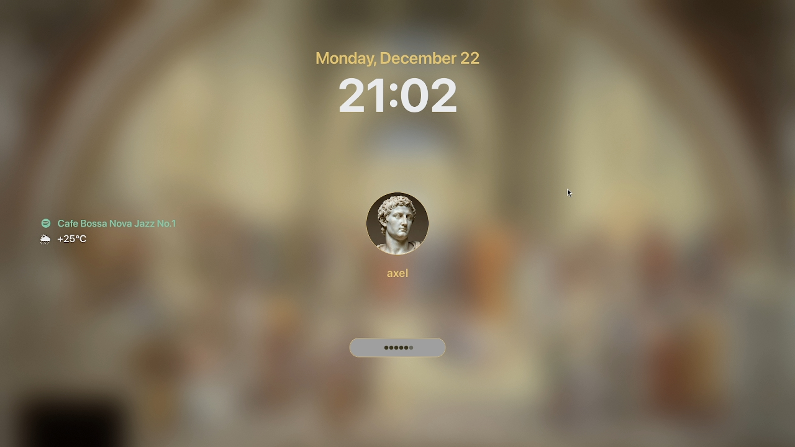
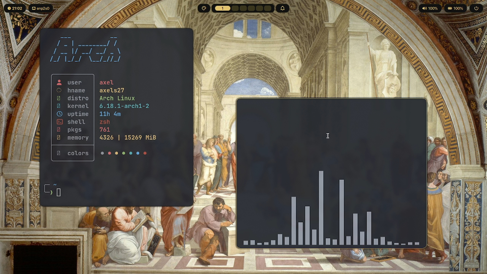
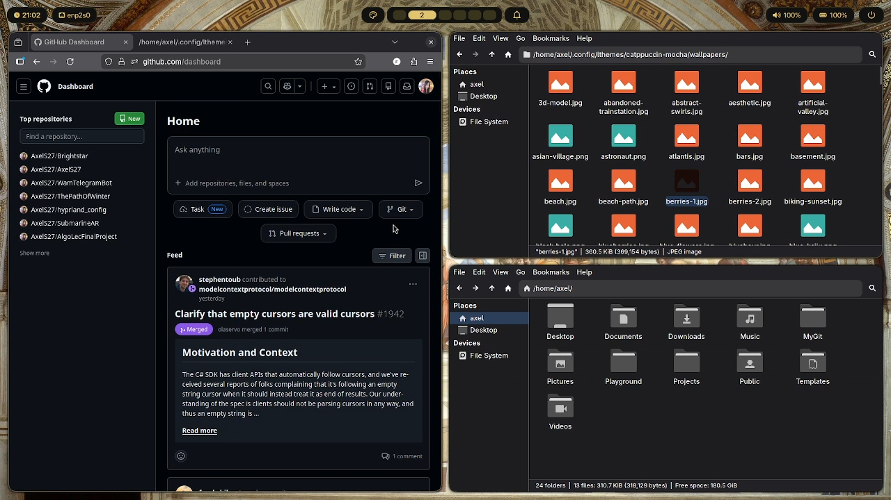
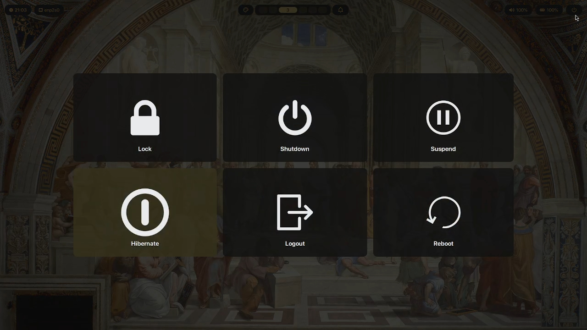
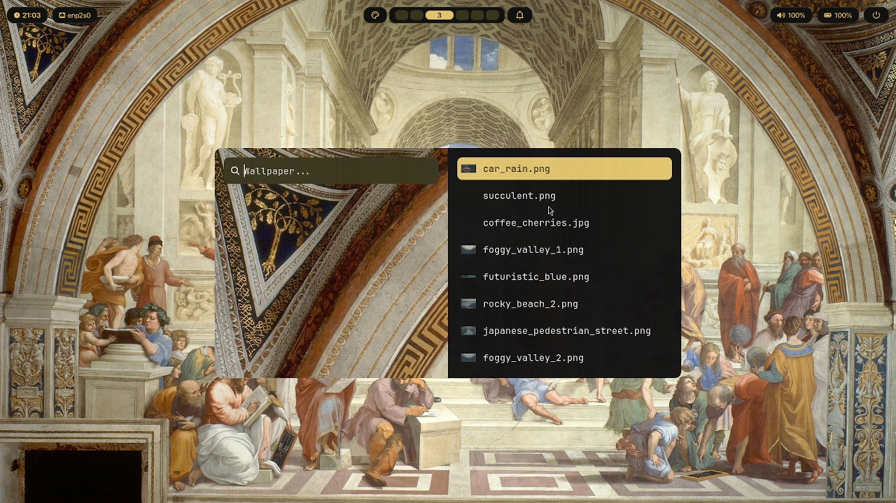
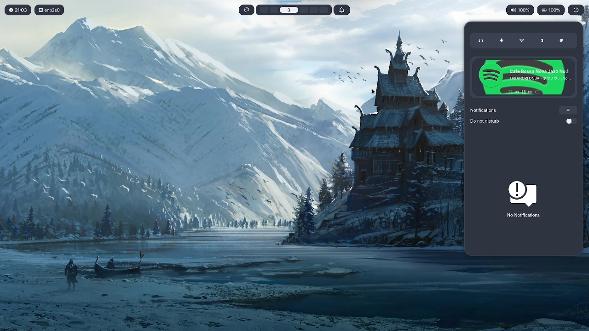
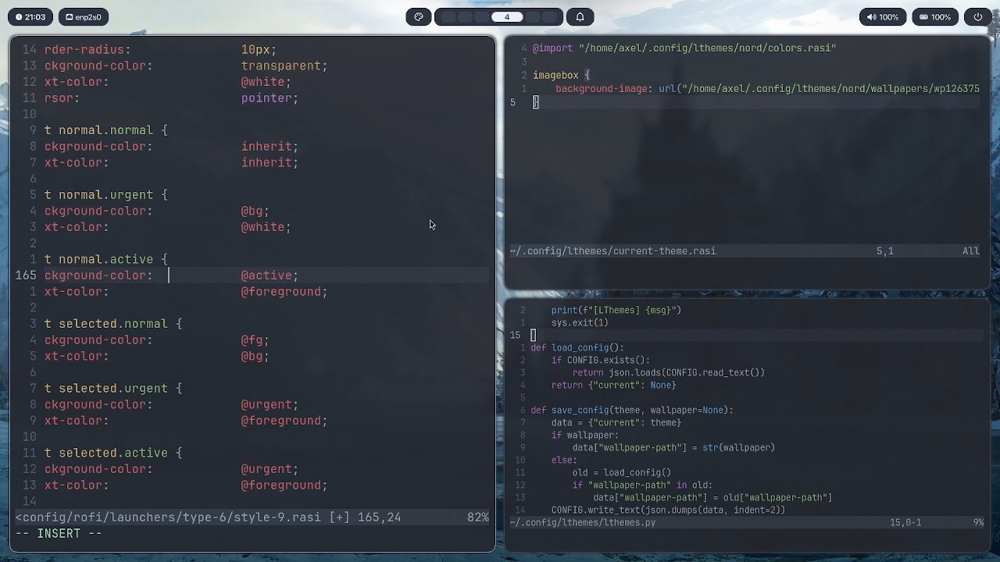
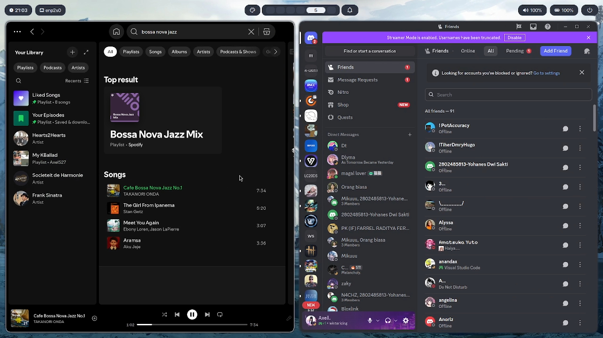

# 🧊 Hyprland Config

A minimal and aesthetic Hyprland configuration focused on performance, workflow efficiency, and visual clarity.

---

## 🎥 Demo

Smooth workflow, animations, and overall setup preview:

[Watch Demo]([https://i.imgur.com/ElNTl1I.mp4](https://drive.google.com/file/d/1UMwLYPobl3krsPro_AKdKI5EJXK9DU78/view?usp=sharing)

---

## 📸 Preview

  
  
  

  
  
  

  
  
  

  

---

## ⚙️ Features

- Clean and minimal UI setup  
- Smooth window animations  
- Efficient workspace management  
- Custom keybindings and workflow optimization  
- Consistent theming across components  

---

## 🛠️ Stack

Hyprland • Wayland  
Waybar • Wofi  
Kitty • Neovim  

---

## ⚡ Notes

This configuration is designed to balance aesthetics and usability, providing a fast and distraction-free Linux desktop experience.
